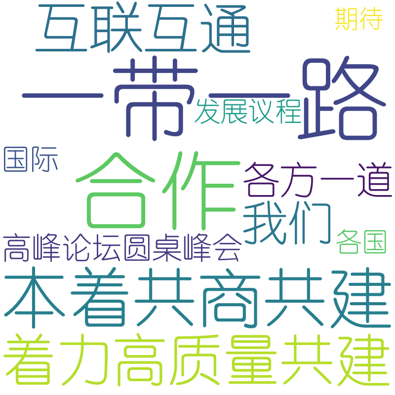

# 根据jieba生成关键短语

# 使用
```python
    from KeyPhraseExtraction import KeyPhraseExtraction
    
    text = ""
    key_phrase_extractor = KeyPhraseExtraction(topk=50)
    
    # 短语及权重
    key_phrase = key_phrase_extractor.key_phrase_extraction(text)
    
    # 生成词云
    key_phrase_extractor.wordcloud(key_phrase)
```

# 效果
